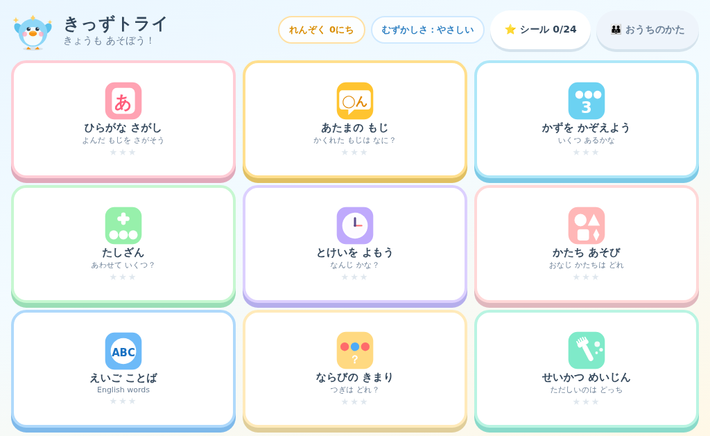
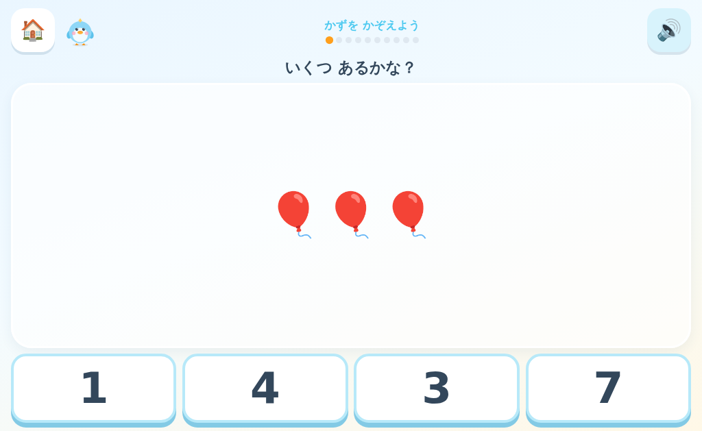
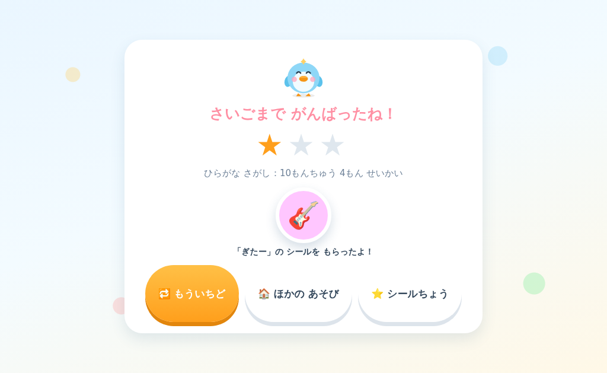
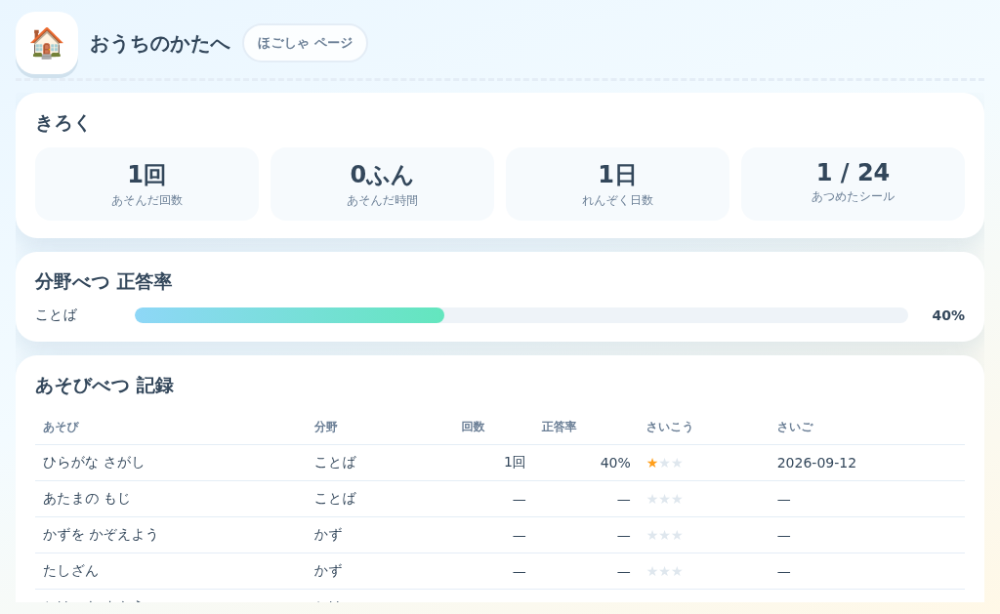

# きっずトライ（kidstry）

5さいじ（年中〜年長）むけの **知育タブレットアプリ**です。
ひらがな・かず・とけい・えいご・かたち・ちえ・せいかつしゅうかんを、9つのミニゲームで楽しく学べます。

- 📱 タブレット横持ち最適化（スマホ縦持ちでも動きます）
- 🔌 **ビルド不要・依存パッケージゼロ**。ローカルサーバーを立てるだけで動作
- ✈️ PWA対応（ホーム画面に追加してオフラインで遊べます）
- 🔒 データは端末内（localStorage）のみ。通信・外部送信は一切ありません



| あそび中 | けっか | おうちのかた |
|---|---|---|
|  |  |  |

## あそべる内容（9つ）

| あそび | 分野 | 内容 | むずかしさによる変化 |
|---|---|---|---|
| ひらがな さがし | ことば | 読まれた文字を4択で選ぶ | 清音 → 濁音・半濁音 → カタカナ |
| あたまの もじ | ことば | 絵とことばの隠れた1文字を当てる | 清音はじまり → 全部 → 最後の文字 |
| かずを かぞえよう | かず | 絵の数を数えて数字を選ぶ | 1〜5 → 1〜10 → 6〜20 |
| たしざん | かず | あわせていくつ？ | 合計5まで → 10まで → 20まで |
| とけいを よもう | とけい | アナログ時計を読む | ちょうど → ○時半も → まぎらわしい選択肢 |
| かたち あそび | かたち | まる・さんかく・しかく・ひしがた・ほし・ハート | 名前で探す → かどの数で探す |
| えいご ことば | えいご | 英語の音声を聞いて絵を選ぶ | 動物・食べ物 → 全単語 → 色・数 |
| ならびの きまり | ちえ | 規則的な並びの次を当てる | ABAB → AABB/ABC → ABCABC など |
| せいかつ めいじん | せいかつ | 正しい生活習慣を選ぶ | 2択 → 2択 → 3択 |

### 5さいじ向けの配慮

- **漢字ゼロ**。画面の文字はすべて ひらがな・カタカナ
- **制限時間なし・減点なし**。まちがえても「もういちど！」で何度でも挑戦できます
- タップ範囲は最小96px、文字は20px以上。ダブルタップ拡大・長押し選択は無効化
- 問題文は音声で読み上げ（端末の音声合成を使用。使えない端末では文字表示のみで成立します）
- 効果音はすべてWebAudioで合成（音声ファイル不要）
- 1回遊ぶごとに **ごほうびシール**（全24種）が1枚もらえます

### おうちのかたページ

ホーム右上の「👪 おうちのかた」を **3秒長押し** すると開きます（お子さまの誤操作防止）。

- あそんだ回数・時間・連続日数・集めたシール数
- 分野べつ／あそびべつの正答率（＝1回目の選択で正解できた割合）
- むずかしさ（やさしい／ふつう／むずかしい）、効果音・読み上げのON/OFF、おなまえ
- データの全消去

## つかいかた

```bash
git clone https://github.com/IsamuTakiguchi/kidstry.git
cd kidstry
npm start          # http://localhost:4173/ が開けます
```

`npm install` は不要です（依存パッケージがありません）。

### タブレットで遊ぶ

1. PCと タブレットを 同じ Wi-Fi につなぐ
2. PCで `npm start` を実行
3. タブレットのブラウザで `http://<PCのIPアドレス>:4173/` を開く
4. ブラウザのメニューから「ホーム画面に追加」すると、アプリのように全画面で起動し、オフラインでも遊べます

> ⚠️ iOS/iPadOS の Safari では、Service Worker と「ホーム画面に追加」を使うために **HTTPS もしくは localhost** が必要です。
> `http://192.168.x.x` で開いた場合もアプリ自体は動作しますが、オフライン機能は無効になります。

## 開発

```bash
npm test           # ユニットテスト（node:test / 依存ゼロ）
npm run icons      # SVGアセット生成 → PNGアイコン書き出し
npm run smoke      # ブラウザ自動操作テスト＋スクリーンショット撮影
```

### スクリプトについて

| コマンド | 中身 |
|---|---|
| `npm start` | `tools/serve.mjs`。Node標準モジュールだけの静的サーバー（ESモジュール配信に必要） |
| `npm test` | `tests/*.test.mjs` を実行。問題生成ロジック・記録・描画・アセット整合性を検証 |
| `npm run icons` | `tools/make-assets.mjs` でマスコット・アイコンのSVGを生成し、Chromiumで各サイズのPNGに書き出し |
| `npm run smoke` | Chromiumを **CDP（DevTools Protocol）** で直接操作。9つのあそびが開けるか、1ゲーム最後まで進めるか、コンソールエラーが出ないかを確認し、`docs/screenshots/` に画像を保存 |

`icons` と `smoke` は Chromium/Chrome を使います。見つからない場合は警告を出してスキップするので、ブラウザのない環境でも `npm test` は通ります。
`CHROMIUM_PATH=/path/to/chrome` で明示指定もできます。

### 構成

```
index.html              アプリシェル
manifest.webmanifest    PWAマニフェスト
sw.js                   Service Worker（オフライン動作）
styles/                 base / components / games の3ファイル
src/
  main.js               画面遷移と起動
  core/
    quiz.js             すべてのあそび共通の出題エンジン
    state.js            記録の保存（localStorage）と純粋な計算関数
    audio.js            WebAudio効果音 ＋ 音声読み上げ
    ui.js / ui-shapes.js  DOM・SVGヘルパー
    random.js           シードつき乱数（テスト再現用）
  data/                 ひらがな・ことば・えいご・シールのデータ
  games/                9つのあそびの「問題生成関数」（純粋関数）
  screens/              ホーム・けっか・シールちょう・おうちのかた
assets/
  characters/           マスコット「トリィ」4ポーズ（SVG）
  icons/                アプリ・あそびアイコン（SVG）
  generated/            書き出したPNGアイコン
tools/                  serve / make-assets / make-icons / smoke
tests/                  ユニットテスト
```

あそびを1つ追加するには、`src/games/` に `meta` と `generate(level, rng, count)` を持つファイルを作り、
`src/games/index.js` に登録し、`tools/make-assets.mjs` にアイコンを足すだけです。
画面描画は `core/quiz.js` が共通で受け持つため、UIコードを書く必要はありません。

## つくったもの・権利について

- マスコット **「トリィ」**、アプリアイコン、あそびアイコンは、このリポジトリのために描き下ろしたオリジナルのSVGです
- 絵カード・シールには、OS標準の絵文字（Unicode）を使用しています
- 学習分野の構成は一般的な幼児教育の領域（ことば・かず・とけい・えいご・かたち・ちえ・生活習慣）を参考にしています。
  特定の通信教育サービスのキャラクター・イラスト・音声・商標は一切使用していません

## ライセンス

MIT
